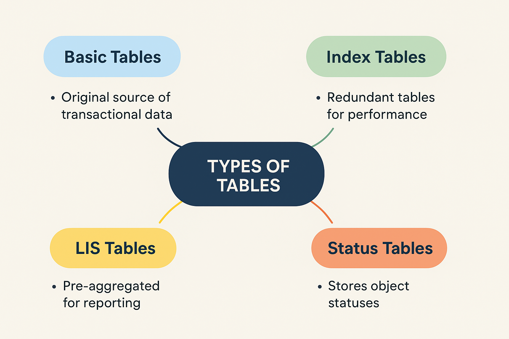

## 🔹 1. Basic Tables (Tabelas básicas)

São as tabelas de transação originais onde os dados são gravados.

Exemplo:

VBAK → Cabeçalho de pedidos de vendas (SD)

BKPF → Cabeçalho de documentos contábeis (FI)

MARA → Dados mestres de material

👉 Em outras palavras: são as tabelas "oficiais", a fonte primária dos dados.

## 🔹 2. Index Tables (Tabelas de índice)

No SAP ECC, o banco de dados tradicional (Oracle, DB2, MS SQL etc.) não conseguia responder consultas analíticas pesadas com velocidade.

Então, para melhorar performance, o SAP criava tabelas de índice (redundantes) que armazenavam dados já pré-agregados ou pré-calculados.

Exemplos:

BSIS / BSAS → índices para saldos de contas contábeis

KONV → condições de preços (índice do SD)

VBRK / VBRP → índice para faturas

👉 Eram necessárias porque os bancos relacionais eram lentos para fazer cálculos “on the fly”.

## 🔹 3. LIS Tables (Logistics Information System – Tabelas de informação logística)

O LIS era uma espécie de “Data Warehouse antigo” dentro do SAP ECC.

Ele armazenava dados agregados de logística (SD, MM, PP) em tabelas de informações (Info Structures), para relatórios estatísticos.

Exemplos de tabelas LIS:

S001, S002, S006 → estruturas de vendas, compras, estoques etc.

Alimentadas via batch jobs e atualizações periódicas.

👉 Na prática, eram relatórios analíticos mantidos em tabelas redundantes para não sobrecarregar as tabelas de transação.

## 🔹 4. Sobre Status Tables

As status tables são diferentes das index e LIS.

Elas não são redundantes, mas sim essenciais para indicar o andamento de um objeto dentro do SAP.

Exemplo de tabelas:

JEST → status individuais (system status e user status) de ordens, WBS, etc.

VBUK → status geral de documento de vendas (ex.: “pendente de faturamento”, “faturado”).

VBUP → status de item do documento de vendas.

Tipos de status:

System Status (ESTAT) → gerado pelo próprio SAP (ex.: “Liberado”, “Encerrado”).

User Status (ESTAT) → definido pelo usuário/configuração (ex.: “Em Aprovação”).

👉 Eles são usados em workflows, relatórios e processos, porque o SAP precisa saber “em que ponto do ciclo de vida” está cada documento ou objeto.

## 🔹 5. O que muda no SAP S/4HANA

Com a chegada do banco HANA (in-memory), a filosofia mudou:

Basic tables continuam existindo (BKPF, VBAK, MARA, etc.).

Index tables e LIS tables foram eliminadas → não são mais necessárias.

O HANA consegue processar consultas complexas em tempo real, sem precisar de tabelas de índice redundantes.

Exemplo: as tabelas BSIS, BSAS, GLT0 não existem mais. Agora, você tem a tabela única ACDOCA (Universal Journal), que armazena todas as linhas de FI + CO + ML + AA.

Relatórios LIS foram substituídos por CDS Views + Embedded Analytics no S/4HANA.

## 👉 Resumindo:

No ECC: precisávamos de Basic + Index + LIS.

No S/4HANA: ficamos apenas com as Basic tables + Views (sem redundância).

📌 Resumo rápido:

- Basic tables → dados de origem. Dados transacionais "originais".

- Index tables → cópias pré-calculadas para performance (ECC). (Não existem mais no S/4HANA).

- LIS tables → agregações para relatórios logísticos (ECC). (Também eliminadas no S/4HANA).

- Status tables → armazenam o status de objetos/documentos (ainda existem no S/4HANA, pois fazem parte do controle de processo).

- S/4HANA → elimina redundâncias, usa apenas tabelas principais + views analíticas.

